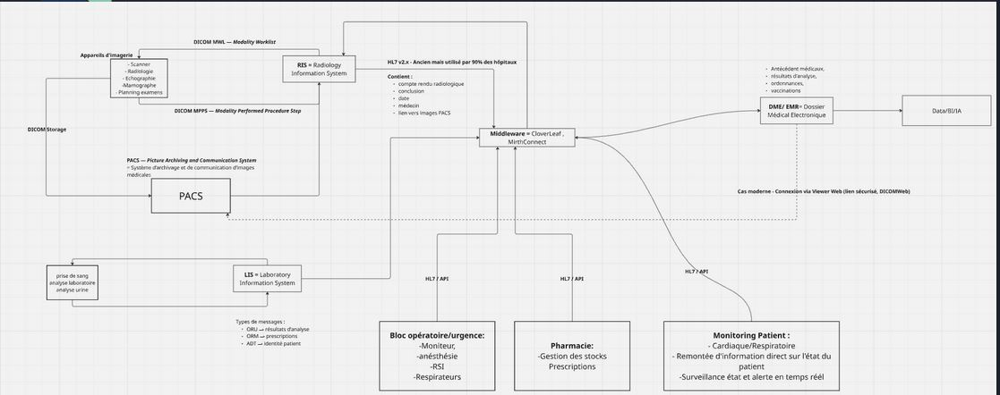
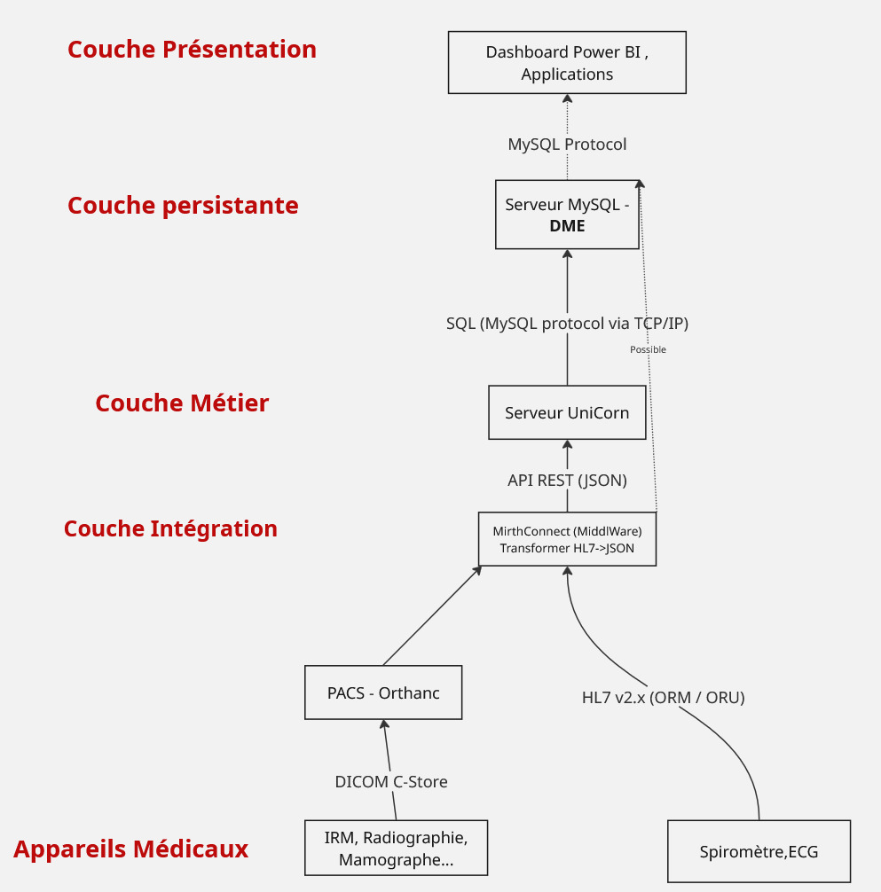

# Projet Hospitalier - Gestion de Flux Médicaux


#### Lien vers la présentation du projet

J'ai créé une vidéo pour présenter le projet , vous pouvez cliquer dessus pour la consulter.

=========>   [Vidéo du projet - Démonstration](https://youtu.be/0jdeQDBnau4)  <=====================

## Introduction

Ce projet est un **système simulé de réseau hospitalier** intégrant plusieurs applications et flux de données :

- **FastAPI** : backend pour la gestion des patients, examens, observations et alertes.
- **MySQL** : base de données relationnelle stockant toutes les informations.
- **Mirth Connect** : middleware pour simuler les messages HL7 et DICOM.
- **Node.js ** : frontend ou micro-app complémentaire.
- **Power BI** : dashboard pour visualiser les données patients et alertes.

---

## Structure du projet

##### app

Application avec serveur Node.js, notifie une alerte en cas de test médical dangereux.  
⚙️ Pour la lancer en local :  
1. Configurer le `.env`  
2. Retélécharger les dépendances avec :  

```
npm install
```

##### dashboard

Dashboard Power BI qui importe les données du DME (Dossier Médical Électronique) des patients.

##### db

Contient :
- Le schéma SQL de la base de données
- Des exemples de données factices pour concevoir et tester la base

##### docs

Schémas des flux dans le projet et également dans un système hospitalier classique.

##### mirth

Channel au format XML traducteur des messages HL7 pour l'application.
⚙️ Il convient de l'importer depuis Mirth Connect pour tester le projet en local.

##### serveur_http

Serveur HTTP Uvicorn avec API FastAPI pour rediriger les flux vers la base SQL.
⚙️ Pour le tester en local :
- Configurer le .env
- Installer les dépendances avec :
```
pip install -r requirements.txt
```
Lancer le serveur :
```
uvicorn app.main:app --host 0.0.0.0 --port 3000 --reload
```

## Schéma et flux
Pour mieux comprendre le fonctionnement du projet et les flux de données, voici les schémas :

### Architecture d'un réseau complet hospitalier traditionnel



### Architecture du projet




